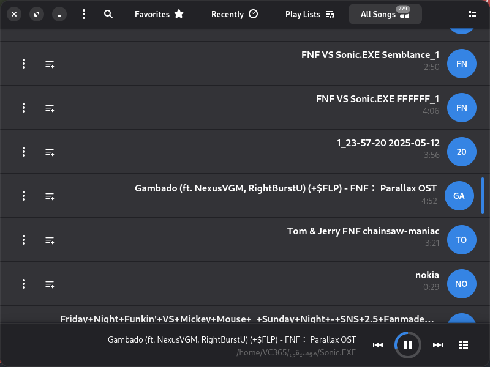

  

<h1 align="center">VCMusic</h1>
<h4 align="center">Simple and lightweight music player</h4>

   
    

     

# Building

## Dependencies

- `Crystal` - `~1.21.0`
- `GTK`
- `libadwaita`
- `gettext`
- `gstreamer`
- `gstreamer-pbutils-1.0`
- `rubberband-ladspa` (optional)

### Makefile

1. `$ make`
2. `# make install` # To install it

# Contributing

1. Fork it ( https://github.com/VC365/VCMusic/fork )
2. Create your feature branch (git checkout -b my-new-feature)
3. Commit your changes (git commit -am 'Add some feature')
4. Push to the branch (git push origin my-new-feature)
5. Create a new Pull Request